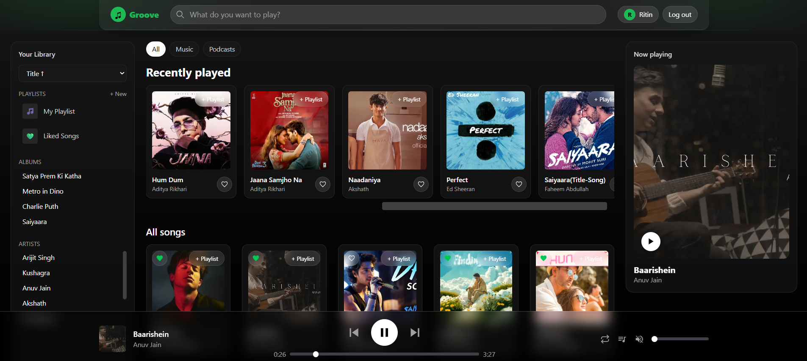
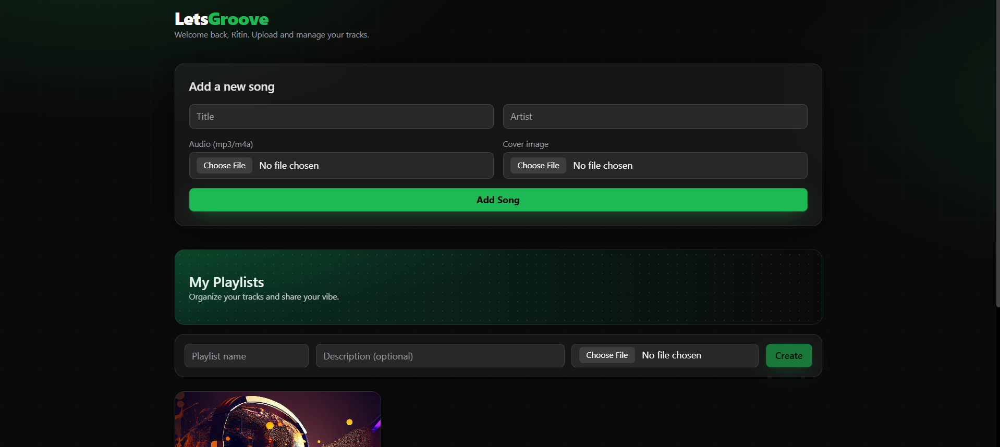

# 🎶 Groove — Spotify-Inspired Music Player  

Premium, production-ready **Next.js application** for streaming music.  
A sleek **glassmorphism UI**, real-time **Supabase backend**, and **global player context** with playlists, liked songs, and smooth animations.  

  
  
  
  
  

---

## ✨ Live Demo  

👉 [**Vercel Deployment**](https://groove-music-player-next-js.vercel.app/)  

---

## 📸 Screenshots  

 
 |

## 🌟 Features  

- 🎧 **Global Player Context** — real-time playback, queue, seek, next/prev, volume  
- ❤️ **Liked Songs** — per-user favorites with optimistic updates  
- 🎵 **Playlists** — create, edit, add/remove tracks (per user)  
- 🔎 **Library** — search, filter by artist/album, sort  
- 🔐 **Supabase Auth** — email/password, providers ready  
- ⚡ **Data Fetching** — TanStack Query (v5) for caching and mutations  
- 🌓 **UI/UX** — Tailwind glassmorphism, smooth transitions, a11y support  

---

## 🧰 Tech Stack  

- **Frontend:** Next.js 14, React, TypeScript, TailwindCSS  
- **Backend:** Supabase (Postgres, Auth, Storage, RLS)  
- **Data:** TanStack Query (v5)  
- **Player:** HTMLAudioElement + custom React Context  
- **UI/UX Enhancers:** react-icons, lucide-react, shadcn/ui (optional)  

